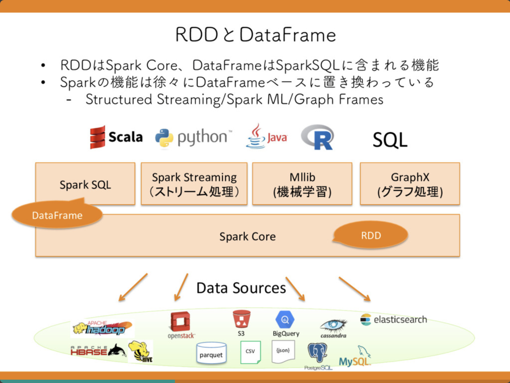

# **Pyspark** の初めの1歩

---

# アジェンダ
+ Pysparkとは?
+ 使い方は?
+ 気を付けるべき点
+ まとめ

---

## Pysparkとは?

Apache SparkをPythonでラッパーしたライブラリ
Apache Spark(https://spark.apache.org/documentation.html)
現在はversion3.xまで出ている

そのため、Pysparkはなんなのかということは、sparkを理解すれば解決する事になる

---

## Apache Sparkとは?(wiki君より)

Apache Sparkとは**オープンソース**のクラスタコンピューティングフレームワークである。暗黙のデータ並列性と対象外性を備えたクラスタ全体をプログラミングできる(wiki参照)

...

......

wikiから見たのがいけないんだ!公式を見てみよう!

---

## Apache Sparkとは?(こーしき)

大規模なデータ処理のための統合分析エンジン。java, scale, PythonおよびRのAPIを提供!
また、SQLおよび構造化データ処理のためのSparkSQL,機械学習のためのMLlib、グラフ処理のためのGraphX、逐次計算およびストリーム処理のための構造化ストリーミングを含む高レベルの充実ツールがあるよ!

......

---

---

## Apache Sparkとは?
+ 大量のデータをいい感じに並列処理してくれて捌ける
+ 処理がMapReduceに比べて超高速(インメモリ処理のため)
+ ついでに加工もできる
+ データの出力方法を複数選択できる

---

<!-- Scoped style -->

引用(https://speakerdeck.com/chie8842/pythondeda-liang-detachu-li-pysparkwoyong-itadetachu-li-tofen-xi-falsekihon?slide=14)

---

## 使い方

環境構築はいろいろとめんどそうだった(jdkいれて、spark入れてパス通してうんぬんかんぬん)ので、docker-hubで公開されている**いい感じ**のイメージを拝借したいと思います

url()

---

## Jupyter notebookとは

データ分析、研究機構当でよく利用されています(知りませんでいた...)
ブラウザ上でコードを実行できたり、ドキュメントを作成できたりします

---
## 参考資料
apache spark(https://spark.apache.org/documentation.html)

pyspark(https://spark.apache.org/docs/latest/api/python/index.html)

---